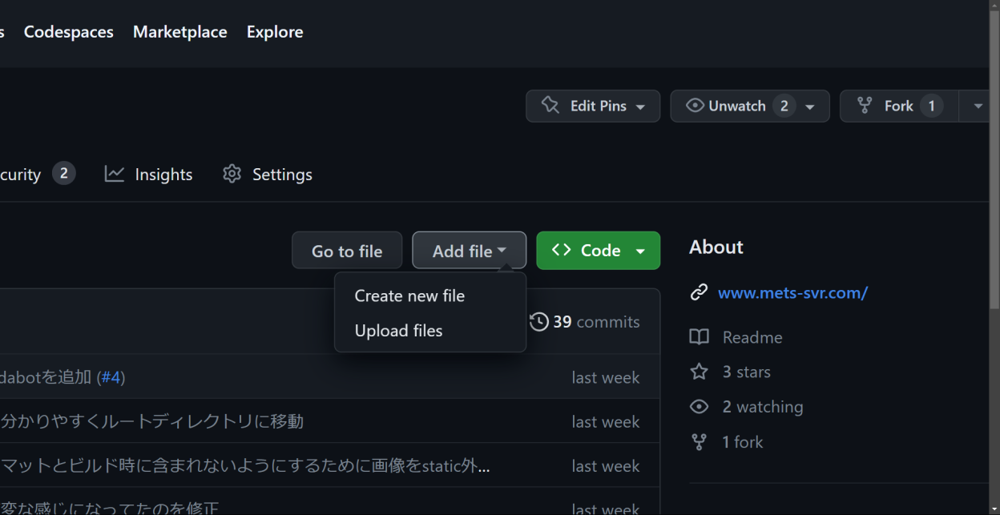

---
authors:
  - Crab55e
tags:
  - management
  - write
  - blog
---

# ブログ記事の書き方解説

まったく何も知らない状態から Met's 鯖のブログを書く方法を 1 から解説します</br>
全然難しい内容ではないので身構えず読んでいってください

## 必要なもの

- PC(最悪スマホだけでも可)
- メールアドレス

## 大まかな順序

1. [GitHub アカウントを作成する](#github-アカウントを作成する)(★★☆☆☆)
2. [プロフィールを設定する](#プロフィールを設定する)(★☆☆☆☆)
3. [Mets-org に参加する](#mets-org-に参加する)(★★☆☆☆)
4. [用語について理解する](#用語について理解する)
5. [著者の一人として登録する](#著者の一人として登録する)(★☆☆☆☆)
6. [基本的な構文を覚える](#基本的な構文を覚える)(★★☆☆☆)
7. [投稿する](#投稿する)(★★☆☆☆)

###### ★ むずかしさ

## GitHub アカウントを作成する

### GitHub とは

GitHub とは世界中の開発者が集まってコードやプログラムを共有している SNS です</br>
GitHub にはコードを管理するために便利な仕組みがたくさんあり、そのほかにも色々な機能があります</br>
それらの機能を使ってブログページの管理や公開をしています

### GitHub アカウントを作成する

次の手順を踏み、GitHub のアカウントを作成します</br>
既に GitHub のアカウントを持っている人はこの手順を飛ばして [Mets-org に参加する](#mets-org-に参加する)から始めてください

### GitHub のページを開く

[ここから GitHub](//github.com)を開いて、"Sign up"を押します</br>


<!-- githubのトップページ画像、多分パス修正が必要 -->

### 情報を入力する

メールアドレスや、パスワードなどを入力して認証を受ける</br>
</br>
**Enter your email**にはメールアドレスを</br>
**Create a password**にはパスワードを</br>
**Enter a username**にはユーザー名を入力します</br>
その下の</br>
「Would you like to receive product updates and announcements via email?
Type "y" for yes or "n" for no」</br>
は GitHub からのアップデートやアナウンスなどの情報をメールで受け取るかどうかを"yes(y) or no(n)"で入力します</br>
ロボット認証が終わったら、**Create account**を押します</br>
そうすると、設定したメールアドレスに認証コードが送られます</br>
そのコードを入力するとアカウントを作成出来ます</br>
そしたら、次の手順に移りましょう

## プロフィールを設定する

プロフィールを設定します、アカウントのアイコン画像などを用意しておいてください</br>
</br>
最初の画面はこんな感じになります、これはユーザーに合わせて github の設定を変えていくものなんですが</br>
スキップできるので今回は下にうっすらある**Skip personalization**を押しましょう
そうするときれいな景色が見えてきます(一瞬)、そして GitHub アカウントの作成は完了です</br>
そしたらさっそくプロフィールを設定しましょう</br>
[https://github.com/settings/profile](https://github.com/settings/profile)に進んでいい感じにしといてください

## Mets-org に参加する

Mets-org に参加します、Mets-org とは GitHub 上にある Met's サーバーのグループです</br>
Mets-org には Met's サーバーにいる何人かの開発者やブログの著者などが集まっています</br>
具体的には次のような手順で参加します

### 招待を送ってもらう

Mets-org の管理者に招待を送ってもらいます
Discord のチケットや会話チャンネルなどでお願いしてみましょう

### 承認する

実はここら辺あんま覚えてないんですよね...</br>
GitHub にある[Mets-org](https://github.com/Mets-org)のページとか見たら横に Join や Accept みたいなボタンがあるかもしれません...</br>
探してみてください
もしどうしても見つからなかったら Discord で誰かにヘルプを求めましょう
ちなみにこの手順を終えることで、あなたは Mets-org のファイルなどを変更する権限を得られます

## 用語について理解する

説明や記事を書くうえで理解しておくべき最低限の用語について解説します</br>
この欄の最後にちょっと上級な用語も解説します

| 用語の名前   | 読み                       | 説明                                                                                                                                                                    |
| ------------ | -------------------------- | ----------------------------------------------------------------------------------------------------------------------------------------------------------------------- |
| Repository   | リポジトリ                 | GitHub ではプロジェクトを Repository という単位で表します、ブログや利用規約をまとめてあるこのプロジェクトは、www.mets-svr.com という名前のリポジトリですね              |
| Commit       | コミット                   | ファイルやフォルダなどの構造への変更を GitHub 上に登録し、反映することです                                                                                              |
| Issue        | イシュー                   | リポジトリに対してバグや改善点などの報告を行う事                                                                                                                        |
| Pull request | プルリクエスト             | [Pull requests](https://github.com/Mets-org/www.mets-svr.com/pulls)欄などから作成する、既存のリポジトリ(プロジェクト)に対して変更を反映してください！っていうリクエスト |
| Organization | オルガナイゼーション(多分) | 上のほうでも話した通り、複数のメンバーからなる開発組織、グループ                                                                                                        |

例文:

- 「mets 鯖の Organization のリポジトリに豚の調理方法についての新しいブログ記事をコミットする」
- 「美味しいチャーシューの作り方についての記事を作ったので、mets 鯖のブログに入れてほしい、プルリクを送ろう」
- 「昨日書いた豚の調理方法についての記事にミスがあった、今すぐ修正するのはめんどくさいからとりあえず Issue を出しておこう」

ここからたまに役に立つかもしれない上級用語
| 用語の名前 | 読み | 説明 |
| ---------- | ---- | ---- |
| Markdown | マークダウン | 簡単に文字の大きさやスタイルなどを変えられる表記方法 |
| Contributor | コントリビューター | リポジトリやその内容の作成について関わった人や、その権限を持つ人 |
| Deploy | デプロイ | 変更したデータを実際に使う場所に設置すること（ここでは主に変更した記事が web サイトに反映されることを表します） |

## 著者の一人として登録する

[authors.yml](https://github.com/Mets-org/www.mets-svr.com/blob/main/blog/authors.yml)から自分をを著者の一覧に追加します</br>
具体的には以下のようにプロフィールを記述します

```yaml
<MCID>:
  name: <表示名>
  title: <簡単な自己紹介>
  url: <SNSなどのリンク>
  image_url: <プロフィール画像のリンク>
  email: <任意>
```

プロフィール画像のリンクは imgur などのサービスを利用するか、mets-svr.com で提供します
email の部分を設定したくない場合は、そのラインを削除して使ってください
MCID の部分は、あとで使います

## 新しくページを作成する

GitHub 上にブログページを作成します</br>
具体的には次の手順を踏みます</br>
### リポジトリを開く
[Mets-org/www.mets-svr.com](https://github.com/Mets-org/www.mets-svr.com) を開いて</br>
`blog`というフォルダを開きます、そして`Add file`、`Create new file`を押します</br>
</br>
そうしたら、`Name your file...`の欄にファイル名を書きます、ここは簡潔でわかりやすく英単語で記載しましょう</br>
例えば、和風のおしゃれなおうちの作り方についての記事であれば、`build_the_japanese_house.md`といった名前が適しているでしょう</br>
他にも、クリーパートラップに作り方についての記事であれば、`build_the_gunpowder_farm.md`といった名前でも良いでしょう</br>
ファイル名は必ず、`.md`で終わります</br>
また、空白を表現する場合は`_`(アンダーバー)を使用します</br>
なるべく既存の規則にしたかがった命名をするようにしましょう

## 基本的な構文を覚える

いよいよやってきましたね！</br>
記事を書く時！！！</br>
記事を書く際には、マークダウンというものを使用します</br>
マークダウンとは、文や表、画像、リンクなどを**簡単にわかりやすく**記述する方法です</br>
マークダウンについては既に分かりやすい記事があるのでそちらを読んでみてください

> [Markdown 記法・GitHub Gist](https://gist.github.com/mignonstyle/083c9e1651d7734f84c99b8cf49d57fa)

ちなみに実はこれとプラスでちょっと覚えるべきものがあります</br>
それが、基本的な構文です</br>
ブログを書く際は次のように書いて、その下に記事の内容を書いていきます

```md
---
authors:
  - MCID
tags:
  - blog
---

# タイトル
```

こんな感じです、簡単でしょう？</br>
さっき言っていた MCID をあそこに書きます
その下にタグを書きます、その記事がどんなカテゴリにものなのか定義しましょう
ちなみに、複数の人と記事を書く場合は

```md
---
authors:
  - MCID
  - MCID1
tags:
  - blog
  - collaboration
---

# タイトル
```

などと書きます、タグの場合も同様です

## 投稿する

さて！あなたが頑張って、時間をかけて作成した最初の記事を投稿</br>
記事の投稿方法はいたってシンプル、所定の場所にマークダウンファイルを置き、内容をコミットするだけ！コミット
コミットするときはメッセージを入力しましょう**Commit new file**の欄の、すぐ下のテキストボックス</br>
"Create ○○.md"のところに変更内容を簡潔に表しましょう</br>
もし、詳細な情報を明示する必要があるならばその下の欄に書きましょう！

これであなたもブロガー！

# さいごに

お疲れさまでした、以上で"ブログの書き方解説"は終わりとなります</br>
誤字の修正や記事の改善など、より "ブログ記事の書き方解説"をわかりやすくする案などあれば</br>
Pull requestなどお待ちしております
では、ありがとうございました
