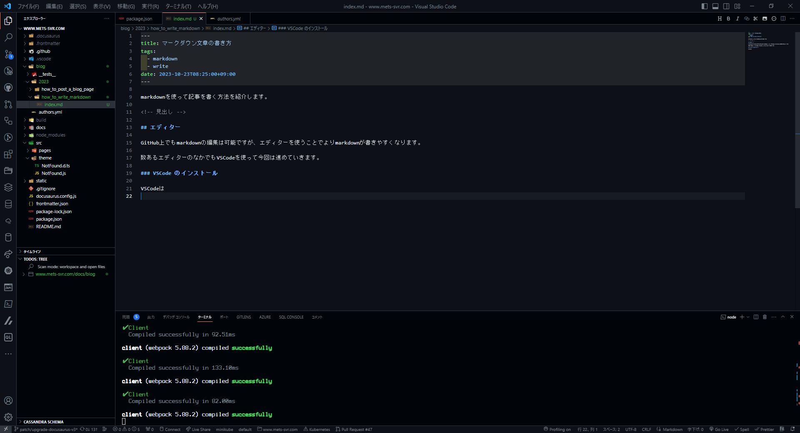
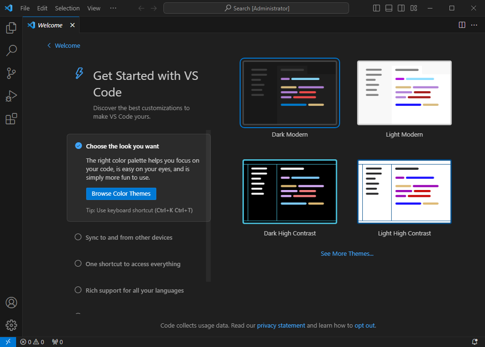
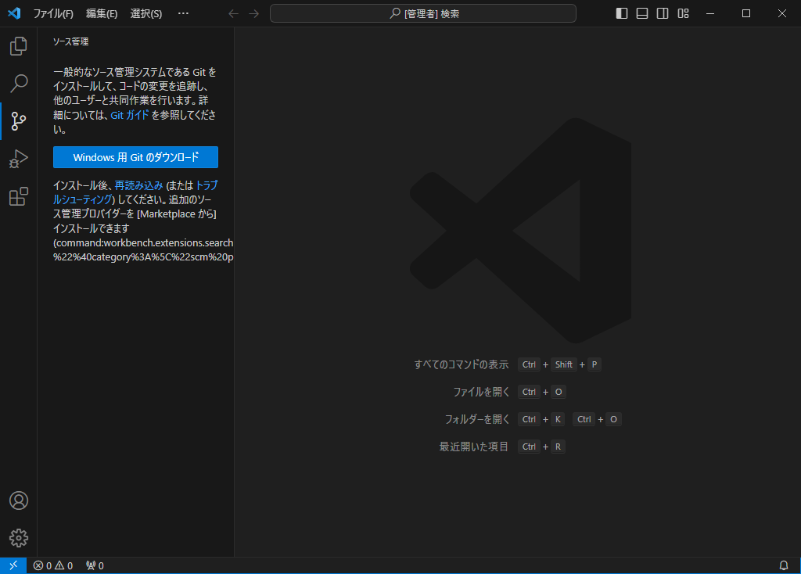
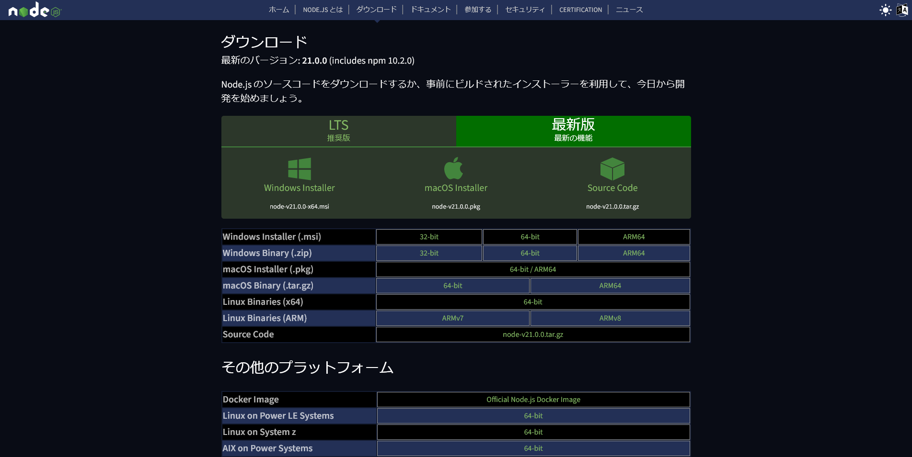

ローカル環境でブログ記事を書く方法を紹介します。

<!-- 見出し -->

## エディターを用意する

GitHub上でもブログ記事の編集は可能ですが、エディターを使うことでよりmarkdownが書きやすくなります。

数あるエディターのなかでも今回はVSCodeを使って進めていきます。

### VSCode のインストール

VSCodeは様々な機能を持ったテキストエディタです。
拡張機能を使うことで様々な用途に使うことができます。

[VSCodeのダウンロードページ](https://code.visualstudio.com/download) からVSCodeのインストーラーをダウンロードしましょう。

インストーラーをダウンロードしたらそのままVSCodeをインストールします。
インストーラーの指示通りにOKを押していってインストールが完了したらVSCodeを起動します。



画像のような画面になったら左のサイドバーにある四角形四つのアイコンをクリックし、拡張機能のタブを開きます。

そして検索欄に `Japanese` と入力したら一番上に出てくる `Japanese Language Pack for Visual Studio Code` という拡張機能をインストールします。

左下に言語を変更して再起動する旨が通知されるので `Change Language and Restart` をクリックして再起動します。


### VSCode に拡張機能を導入する

ショートカットキー `Ctrl + P` を押し入力欄に、

```plain
ext install DavidAnson.vscode-markdownlint yzhang.markdown-all-in-one shd101wyy.markdown-preview-enhanced unifiedjs.vscode-mdx xyc.vscode-mdx-preview bierner.markdown-yaml-preamble
```

を入力し拡張機能タブに表示された拡張機能をすべてインストールします。


### Git を導入する

左のサイドバーにあるソース管理タブを開いた際に Git がインストールされていない場合は画像のような表示になります。



インストールされていない場合、Gitをインストールする必要があります。

`Ctrl + @` を押しターミナルを開きそこで以下のコマンドを実行します。

#### Windows

```sh
winget install --id Git.Git -e --source winget
```

#### Mac OS

```sh
brew install git
```

#### Linux

ディストリビューションに合わせて[このページ](https://git-scm.com/download/linux)にあるコマンドを実行します。

### リポジトリをクローンする

Git がインストールされていること前提とします。もしインストールされていないのであれば前の章の通りに Git をインストールしてください。

左にあるソース管理のタブを開き、 `リポジトリのクローン` をクリックします。

入力欄が表れるのでそこに

```https
https://github.com/Mets-org/www.mets-svr.com.git
```

と入力し `Enter` を押します。

クローン先のフォルダを聞かれるので適当な場所を指定するとリポジトリがクローンされ、
このウィンドウで開くか問われるので「はい」をクリックしリポジトリを開きましょう。

完了すると以下のような画面になります。


## ローカルでプレビューできる環境を用意する

ローカル上でサイトをプレビューするには node.js が必要です。

### node.js のインストール

[公式サイト](https://nodejs.org/ja/download/current) から**最新版のインストーラー**をダウンロードしましょう。



インストーラーをダウンロードし、インストールも完了したら VSCode を再起動し、
ターミナルに `npm` と入力しnode.jsがインストールできてるか確認しましょう。

### 依存解決

ローカル環境でサイトをプレビューするには依存関係を用意する必要があります。
依存解決の方法は簡単で、ターミナルで以下のコマンドを実行します。

```sh
npm ci
```

### プレビューサーバーを立ち上げる

プレビューサーバーを立ち上げることでローカル環境で行った変更をリアルタイムに確認できます。

```sh
npm run start
```


ターミナルでこのコマンドを実行するとデフォルトのブラウザでプレビューサーバーのタブが開かれます。

終了するときはターミナルで `Ctrl + C` を押しましょう。

## 終わり

いかがでしたか？
このガイドでローカル環境でブログ記事を書ける環境を用意出来たら、どんどん記事を書いてみましょう。
記事の書き方と書いた記事のアップの仕方は次の記事に続きます。

それでは良いブログライフを！
